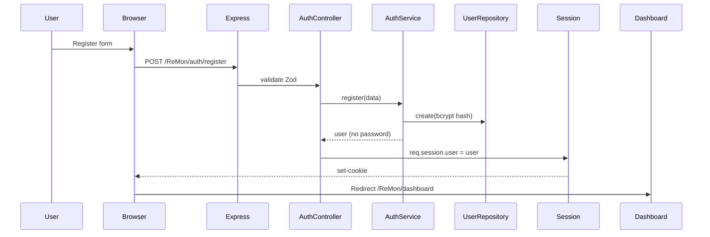

# ReMon — Architecture Overview

## Tech Stack

| Layer | Technology |
|---|---|
| Backend | Express.js |
| Templating | EJS + Tailwind CSS (CDN) |
| ORM | Prisma ORM |
| Database | PostgreSQL (Docker dev / cPanel prod) |
| Auth | Session-based (express-session + bcryptjs) |
| AI | DeepSeek V4 Flash API |
| File upload | Multer |
| Icons | Font Awesome 6 (CDN) |
| PWA | Service Worker + Web Manifest |

## Folder Structure

```
ReMon/
├── prisma/              # Schema & seed data
├── public/              # Static assets (CSS, JS, icons, uploads)
│   ├── css/app.css      # Minimal styles (Tailwind supplement)
│   ├── js/app.js        # Client-side JS (sidebar, toast, notif, SW)
│   └── icons/           # PWA icons (SVG)
├── src/
│   ├── app.js           # Express app setup
│   ├── index.js         # Entry point + global error handlers
│   ├── config/env.js    # Environment config loader
│   ├── middleware/       # Auth, upload, error handler, base path
│   ├── routes/          # Route definitions (aggregated in index.js)
│   ├── controllers/     # Request handlers (thin layer)
│   ├── services/        # Business logic (all logic here)
│   ├── repositories/    # Data access via Prisma
│   ├── validators/      # Zod validation schemas
│   └── views/           # EJS templates
│       ├── auth/        # Login & register (standalone)
│       ├── dashboard/   # Dashboard with Chart.js
│       ├── transactions/# CRUD + receipt upload
│       ├── split-bill/  # Create, detail, manage
│       ├── debts/       # List + create (active/settled)
│       ├── public/      # Public split pay page
│       ├── pwa/         # Service worker, offline page
│       └── partials/    # Header, footer, navbar, sidebar
└── documentation/       # Architecture, DB, API docs
```

## Architecture Pattern

**4-layer separation:**

```
Route → Controller → Service → Repository → Prisma → DB
```

- **Route:** HTTP method + path binding, middleware (auth, upload)
- **Controller:** Parse request, validate input, call service, render response
- **Service:** All business logic, AI calls, cross-cutting concerns (notifications)
- **Repository:** Prisma ORM queries only — no business logic

## Base Path

Semua routes di-prefix dengan `/ReMon` via env variable `APP_BASE_PATH`. Ini diperlukan karena cPanel path.

## Auth Flow



## Error Handling

- Global `errorHandler` middleware catches all route errors
- `process.on('uncaughtException')` + `unhandledRejection` for crashes
- Errors logged to `logs/error.log` with timestamp + stack trace
- Production hides stack traces, shows user-friendly message
